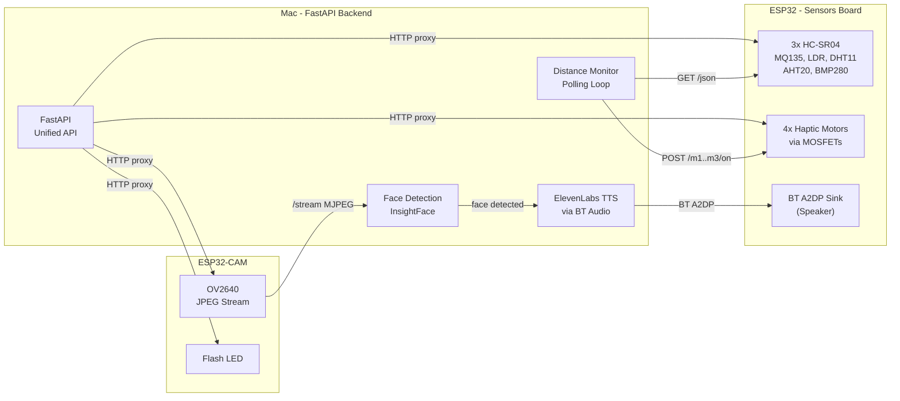

# ESP32 + Camera Unified FastAPI Orchestrator

## Architecture



## 1. Update ESP32 Firmware (`codEsp.c`)

**Add 2 more distance sensors** with user-specified pins:
- Sensor 1 (front): TRIG=16, ECHO=17 (existing)
- Sensor 2 (left):  TRIG=4,  ECHO=2
- Sensor 3 (right): TRIG=14, ECHO=5

**Add all missing HTTP endpoints** (returning JSON for machine consumption):

- `GET /json` - all sensor data + mosfet states + BT status as JSON
- `GET /sensors` - all sensor readings as JSON
- `GET /distance` - 3 distances: `{"front": 42.1, "left": 120.5, "right": null}`
- `GET /light` - LDR reading
- `GET /air` - MQ135 reading
- `GET /status` - plain text summary
- `GET /help` - route listing
- `POST /restart` - `ESP.restart()`
- `GET /m{1-4}/toggle` - toggle individual MOSFETs
- `GET /all/on`, `/all/off`, `/all/toggle` - bulk MOSFET control
- `GET /bt/start`, `/bt/stop`, `/bt/status` - Bluetooth control

The existing `readDistanceCM()` becomes `readDistanceCM(trigPin, echoPin)` accepting pin parameters.

## 2. Update ESP32-CAM Firmware (`codCamera.c`)

Add endpoints:
- `GET /capture` - single JPEG frame
- `GET /flash/on`, `/flash/off`, `/flash/toggle`, `/flash/status` - GPIO 4 (flash LED on AI Thinker)
- `GET /status` - JSON with resolution, wifi RSSI
- `GET /json` - same as status
- `GET /restart` - restart
- `GET /help` - route listing

## 3. Rewrite Python Backend (`imageDetection/main.py`)

Replace the current monolith with a clean FastAPI app. Key changes:

**a) Fix Mac compatibility:**
- Replace `notify-send` (Linux) with `osascript` for macOS notifications
- Replace `subprocess.Popen(["notify-send", ...])` everywhere

**b) ESP32 proxy layer** (`/esp/*` and `/cam/*`):
- Forward all ESP routes via `httpx.AsyncClient`
- Example: `GET /esp/json` → `GET http://{ESP_IP}/json`
- Example: `GET /cam/stream` → proxies MJPEG stream from camera
- Configurable IPs via `.env`: `ESP_IP=10.210.85.xxx`, `CAM_IP=10.210.85.207`

**c) Distance monitor background task:**
- Polls `GET http://{ESP_IP}/distance` every ~200ms
- If front < 50cm → `POST http://{ESP_IP}/m1/on` (front motor)
- If left < 50cm  → `POST http://{ESP_IP}/m2/on` (left motor)
- If right < 50cm → `POST http://{ESP_IP}/m3/on` (right motor)
- If distance >= 50cm → turn off corresponding motor
- Motor 4 reserved for combined/strong alert (all sensors < 30cm)

**d) Face detection background task:**
- Continuously reads MJPEG from camera (reuse `ThreadedCamera`)
- Runs InsightFace every N frames
- On known face match → trigger TTS

**e) TTS via ElevenLabs + Bluetooth speaker:**
- Use ElevenLabs API with model `eleven_flash_v2_5` (~75ms latency, supports Romanian)
- Voice: **Ana Maria** (`urzoE6aZYmSRdFQ6215h`) - warm Romanian female voice
- API key stored in `.env` as `ELEVENLABS_API_KEY`
- Flow: generate MP3 via ElevenLabs REST API → save to temp file → play via `afplay` routed to BT output device
- Use `SwitchAudioSource` or configure Mac audio output to ESP32 BT speaker
- Cooldown per person (30s) to avoid spam and API cost
- Cache common phrases (e.g. "{name} e in fata ta") to avoid re-generating identical audio

**f) Keep existing features:**
- OCR burst mode
- YOLO object detection
- GPT-4o-mini scene description
- All accessible via API + keyboard in OpenCV window

## 4. File Structure After Changes

```
BackendEsp/
  codEsp.c              (updated - 3 sensors + all JSON endpoints)
  codCamera.c           (updated - capture/flash/status endpoints)
  imageDetection/
    main.py             (rewritten - unified FastAPI orchestrator)
    requirements.txt    (updated - add elevenlabs SDK)
    .env                (ESP_IP, CAM_IP, CHATGPT_API_KEY, ELEVENLABS_API_KEY, BT_SPEAKER_NAME)
    known_faces/        (existing)
```

## 5. Key Decisions

- **Sensor-to-motor mapping**: front→M1, left→M2, right→M3, M4 for "all close" alert
- **Distance threshold**: 50cm triggers vibration, configurable via API
- **Polling rate**: ~5Hz for distance sensors (200ms), fast enough for obstacle avoidance
- **TTS**: ElevenLabs Flash v2.5 (`eleven_flash_v2_5`), voice Ana Maria (`urzoE6aZYmSRdFQ6215h`), Romanian female, with local MP3 caching
- **Port**: FastAPI on 8000 (not 5000, to avoid the "address already in use" issue)
